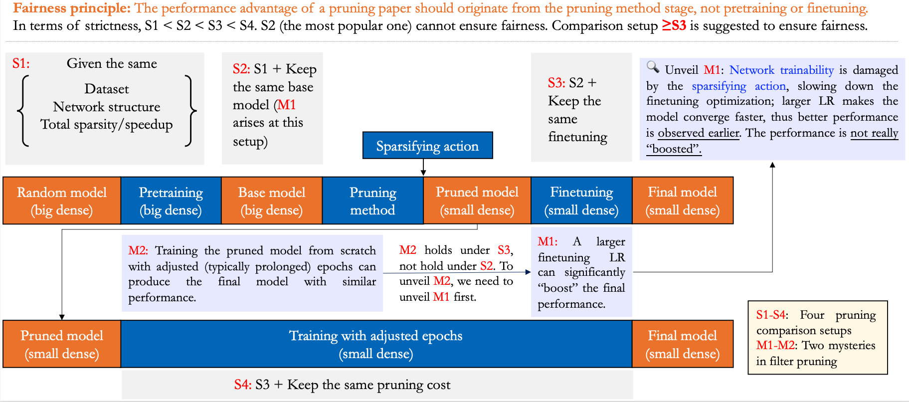

# 

<div align="center">
    <a></a>
    &nbsp &nbsp
    <a></a>
</div>

This repository is for our preprint work that deciphers the recent confusing benchmark situation in neural network (filter) pruning:
> **Why is the State of Neural Network Pruning *so Confusing*? On the Fairness, Comparison Setup, and Trainability in Network Pruning [[ArXiv](https://arxiv.org/abs/2301.05219)]**\
> [Huan Wang](http://huanwang.tech/), [Can Qin](http://canqin.tech/), [Yue Bai](https://yueb17.github.io/), and [Yun Fu](http://www1.ece.neu.edu/~yunfu/) \
> Northeastern University, Boston, MA, USA


## Abstract
<div align="center">
  
</div>
The state of neural network pruning has been noticed to be unclear and even confusing for a while, largely due to "a lack of standardized benchmarks and metrics" [3]. To standardize benchmarks, first, we need to answer: what kind of comparison setup is considered fair? This basic yet crucial question has barely been clarified in the community, unfortunately. Meanwhile, we observe several papers have used (severely) sub-optimal hyper-parameters in pruning experiments, while the reason behind them is also elusive. These sub-optimal hyper-parameters further exacerbate the distorted benchmarks, rendering the state of neural network pruning even more obscure.

Two mysteries in pruning represent such a confusing status: the performance-boosting effect of a larger finetuning learning rate, and the no-value argument of inheriting pretrained weights in filter pruning.

In this work, we attempt to explain the confusing state of network pruning by demystifying the two mysteries. Specifically, (1) we first clarify the fairness principle in pruning experiments and summarize the widely-used comparison setups; (2) then we unveil the two pruning mysteries and point out the central role of network trainability, which has not been well recognized so far; (3) finally, we conclude the paper and give some concrete suggestions regarding how to calibrate the pruning benchmarks in the future.

## Reproducing our results 

TODO: Will update soon. Stay tuned!


## Acknowledgments
In this code we refer to the following implementations: [Regularization-Pruning](https://github.com/MingSun-Tse/Regularization-Pruning), [pytorch imagenet example](https://github.com/pytorch/examples/tree/master/imagenet), [rethinking-network-pruning](https://github.com/Eric-mingjie/rethinking-network-pruning), [EigenDamage-Pytorch](https://github.com/alecwangcq/EigenDamage-Pytorch), [pytorch_resnet_cifar10](https://github.com/akamaster/pytorch_resnet_cifar10). Great thanks to them!

## Citation
Our code helps your research or work, please generously consider to cite our paper, thanks!
```
@article{wang2023why,
    title={Why is the State of Neural Network Pruning so Confusing? On the Fairness, Comparison Setup, and Trainability in Network Pruning},
    author={Wang, Huan and Qin, Can and Bai, Yue and Fu, Yun},
    journal={arXiv preprint arXiv:2301.05219},
    year={2023},
}
```
